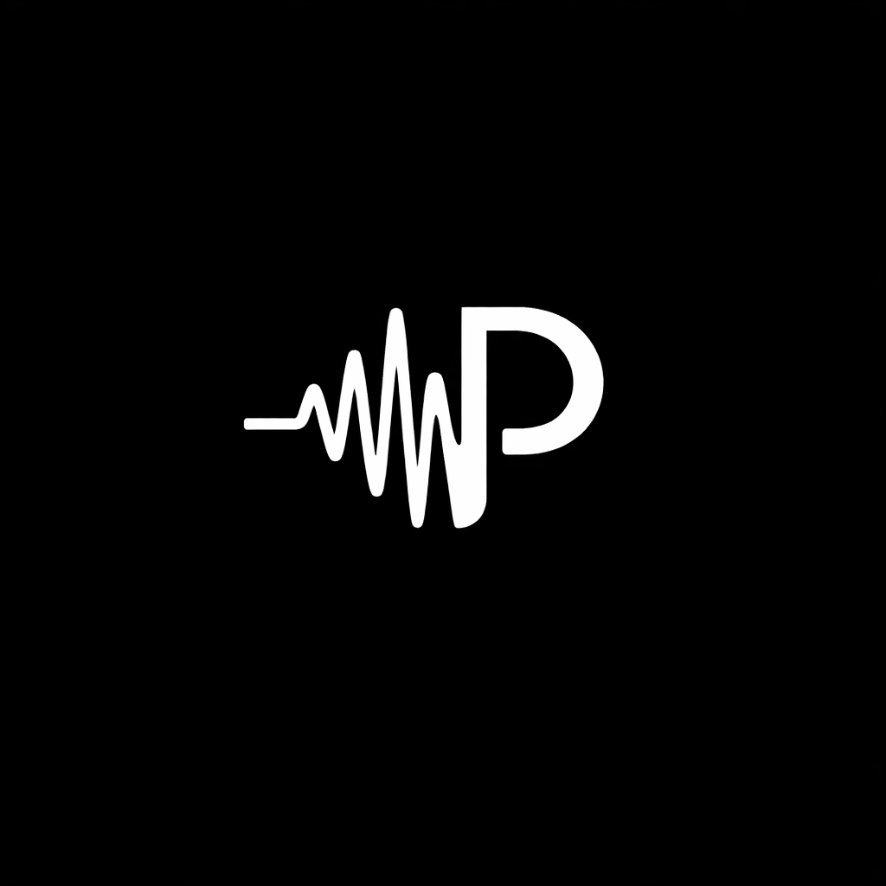

<div align="center">



# @prosodyai/sdk

TypeScript SDK for ProsodyAI.

Transcribe recorded calls, stream live voice analysis, and read speaker
identity and prosody from one client.

[](https://www.npmjs.com/package/@prosodyai/sdk)
[](https://github.com/ProsodyAI/sdk/actions/workflows/ci.yml)
[](https://nodejs.org/)
[](https://www.typescriptlang.org/)
[](./LICENSE)

</div>

---

ProsodyAI measures the suprasegmental layer of speech: intonation, stress,
rhythm, and voice quality, the properties that span syllables and phrases.
Every measurement is speaker-relative. The same F0 is emphatic for one voice
and habitual for another, so the baseline is the reference and the movement
is the meaning.

This SDK exposes three transports, named after the API's own prefixes:

| Transport | Method | What it does |
| --- | --- | --- |
| **analyze** | `prosody.transcribe()` | REST batch over `POST /v1/analyze/audio` |
| **stream** | `prosody.stream` | WebSocket at `WS /v1/stream/realtime`; you send PCM/Opus, events come back |
| **realtime** | `prosody.realtime` | [LiveKit](https://prosodyai.app/docs/livekit) WebRTC media plane; mint a room, read events on the data topic |

## Features

- **Recorded transcription** with diarization and prosody on by default
- **Realtime analysis** over a single WebSocket, frame-paced
- **LiveKit** room credentials and event attachment for browser calls
- **Speaker identity** directory and a preview-then-confirm enrollment flow
- **Typed readouts**: `state` (what was measured) and `change` (what it moved), in family shape
- **Strict TypeScript**, zero runtime dependencies, ESM, tree-shakeable

## Installation

```bash
npm install @prosodyai/sdk
```

```bash
export PROSODY_API_KEY=psk_...
```

Create organization keys at [prosodyai.app](https://prosodyai.app/login).

## Quick start

### Recorded audio

```typescript
import { ProsodyClient } from '@prosodyai/sdk';

const prosody = new ProsodyClient({
  apiKey: process.env.PROSODY_API_KEY!,
});

const result = await prosody.transcribe('./call.wav');

for (const turn of result.turns) {
  console.log({
    speaker: turn.speaker.label,
    text: turn.text,
    pitch: turn.prosody?.state.intonation.pitch,
    loudness: turn.prosody?.state.stress.loudness,
    pitchChange: turn.prosody?.change?.intonation.pitch,
  });
}
```

`transcribe` accepts a local path, an HTTPS URL, or a Node.js `Buffer`.
Diarization and prosody measurement are enabled by default.

### Realtime WebSocket

```typescript
const session = prosody.stream.session({
  encoding: 'pcm16',
  sampleRate: 16_000,
  onUpdate: (current) => render(current.snapshot()),
});

await session.start();
session.send(pcmChunk);
await session.stop();
```

Pace file replay against the server's frame ack:

```typescript
for (const chunk of chunks) {
  session.send(chunk);
  await session.waitForFrame();
}
```

### LiveKit

For a browser call, audio never touches the Prosody WebSocket from the client.
It rides LiveKit's WebRTC media plane. A server-side LiveKit Agent worker runs
the Python [`livekit-plugins-prosodyai`](https://pypi.org/project/livekit-plugins-prosodyai/)
plugin, which bridges the participant's track to the Prosody analysis API and
republishes the committed readouts back onto the room's data topic
(`prosody.events.v1`). This SDK mints the room credentials on the trusted
server, then attaches to the room in the browser and decodes those events into
typed handlers. See the [LiveKit plugin guide](https://prosodyai.app/docs/livekit)
for install, the realtime model, and the committed event stream.

Trusted server (holds `psk_*`):

```typescript
const credentials = await prosody.realtime.createSession({
  participantName: 'caller',
});
// Hand `credentials` to the browser; the Agent worker joins the same room.
```

Browser, after `room.connect()`:

```typescript
const session = prosody.realtime.attach(room, {
  sessionId: credentials.session_id,
  onVoiceFrame: (frame) => render(frame),     // each committed measurement
  onTranscriptUpdate: (event) => render(event),
  onSpeakerUpdate: (event) => render(event),
});

session.start();   // subscribe to prosody.events.v1
// ...later
session.stop();
```

`attach` returns a `ProsodySession` that orders events by `generation`/`seq`
when the wire carries them, drops stale LiveKit republishes, and fans out to
`onVoiceFrame`, `onTranscriptUpdate`, `onSpeakerUpdate`, `onSessionEnd`, and
the rest of the typed family. The browser holds no API key; only the Agent
worker does.

## Speakers

```typescript
const [speaker] = result.speakers;

speaker.id;                              // stable within this call
speaker.label;                           // display label ("Speaker 1")
speaker.talkSeconds;                     // attributed speaking time
speaker.state.intonation.pitch?.median;  // their baseline pitch
speaker.state.stress.loudness?.median;   // their baseline loudness

result.getSpeaker(speaker.id);
result.turnsBySpeaker(speaker);
```

`speaker.id` is recording-local. Durable cross-session identity is a separate
resource. See [Speaker directory and enrollment](#speaker-directory-and-enrollment).

## What a frame measures

Each frame reports the prosodic layer for one speaker at one moment.

```typescript
turn.prosody.state.intonation.pitch    // median F0, Hz
turn.prosody.state.intonation.range    // pitch span, semitones
turn.prosody.state.intonation.slope    // rising or falling contour
turn.prosody.state.stress.loudness     // intensity, dBFS
turn.prosody.state.stress.peak         // loudest instant, dBFS
turn.prosody.state.rhythm.voiced       // fraction phonated, 0 to 1
turn.prosody.state.rhythm.pause        // fraction silent, 0 to 1
turn.prosody.state.rhythm.onset        // phonation restarts per second
turn.prosody.state.tilt                // voice quality: spectral slope
turn.prosody.state.clipping           // signal health
```

A field is `null` when the audio did not support the measurement. Pitch is
`null` on an unvoiced frame, because pitch does not exist on unphonated audio.

`turn.prosody.change` carries the signed movement against the speaker's own
preceding audio, the same families and names as `state`:

```typescript
turn.prosody.change?.intonation.pitch   // semitones against baseline
turn.prosody.change?.stress.loudness    // dB against baseline
```

## Frames

`result.frames` lists the measured frames of the call in order. Each frame
is attributed to a speaker and carries its state, its change, and its affect
reading:

```typescript
for (const frame of result.frames) {
  frame.speakerId;                 // whose lane this frame belongs to
  frame.startMs;                   // where it sits on the call clock
  frame.state.intonation.pitch;    // how they sounded
  frame.change?.intonation.pitch;  // how they moved
  frame.vad;                       // valence/arousal/dominance, when available
}
```

## Speaker directory and enrollment

```typescript
const directory = await prosody.speakers.list();
const preview = await prosody.speakers.previewEnrollment('./enroll.wav');

await prosody.speakers.confirmEnrollment(
  './enroll.wav',
  preview.preview_sha256,
  preview.lanes.map((lane) => ({
    speaker_id: lane.speaker_id,
    display_name: nameFor(lane),
  })),
);
```

Enrollment uses a preview-confirm transaction. Preview returns the detected
lanes; confirm persists the supplied mappings. This is where durable,
cross-session `person_id` identity comes from, distinct from the
recording-local `speaker.id` on a `Transcription`.

## Configuration

```typescript
const prosody = new ProsodyClient({
  apiKey: process.env.PROSODY_API_KEY!,
  headers: { 'X-Trace-Id': traceId },
  debug: true,
});
```

`baseUrl`, `timeoutMs`, and `retry` are optional and have sensible defaults. The client also accepts a bare key: `new ProsodyClient('psk_...')`.

## Error handling

```typescript
import { ProsodyClient, AuthenticationError, RateLimitError } from '@prosodyai/sdk';

try {
  await prosody.transcribe('./call.wav');
} catch (error) {
  if (error instanceof AuthenticationError) {
    // 401: the API key is missing or invalid
  } else if (error instanceof RateLimitError) {
    // 429: retry with backoff
  }
}
```

## Requirements

- Node.js 18 or newer
- A ProsodyAI API key (`psk_*`)

## Documentation

- [Quickstart](https://prosodyai.app/docs/quickstart)
- [ProsodyClient](https://prosodyai.app/docs/reference)
- [Speaker](https://prosodyai.app/docs/reference/speaker)
- [Prosody](https://prosodyai.app/docs/reference/prosody)
- [LiveSession](https://prosodyai.app/docs/reference/live-session)
- [LiveKit plugin](https://prosodyai.app/docs/livekit): full-duplex speech, speaker lanes, and identity on the agent worker

## Contributing

See [CONTRIBUTING.md](./CONTRIBUTING.md). Run the suite from the package root:

```bash
npm run build      # tsc into dist/
npm run typecheck  # tsc --noEmit
npm test           # vitest run
```

## License

MIT. See [LICENSE](./LICENSE).
